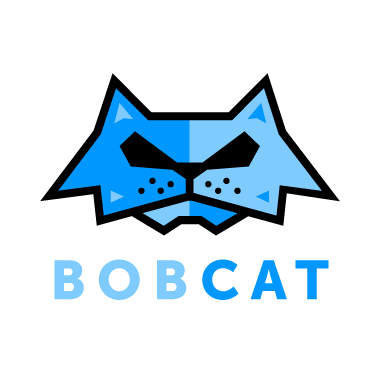

# Bobcat

  

## About Bobcat

Bobcat is an automated testing framework for functional testing of web applications. It wraps Selenium Browser Automation with a handy set of tools (accelerators). Since using Selenium (Webdriver), it aims to mimic the behaviour of a real user, and as such interacts with the HTML of the application. 

Bobcat is implemented in Java and allows test development in pure JUnit and in Gherkin for BDD approaches. Bobcat also provides set of good practices that accelerates testing process.

:smirk_cat: :smirk_cat: :smirk_cat: :smirk_cat: :smirk_cat: :smirk_cat: :smirk_cat: :smirk_cat: :smirk_cat: :smirk_cat: :smirk_cat: :smirk_cat: :smirk_cat: :smirk_cat: :smirk_cat: :smirk_cat: :smirk_cat: :smirk_cat: :smirk_cat: :smirk_cat: :smirk_cat:
## Bobcat 2.0 is coming!

A high level roadmap (milestones still can be changed), without any concrete deadlines of what we plan for 2.0 release:

#### Milestone #1 (still in 1.x.x)
1. Archetype cleanup and move to gradle from end-user side 
2. Selenium version bump
3. Simplify Bobcat configuration

#### Milestone #2 (part of it may end up in 1.x.x)
- Reporting revamp
- General refactoring
    - some parts of API might disappear in the future
    - some modules may end up without further support
- last 1.x.x release
    - deprecation of APIs to be removed

#### Milestone #3
- remove the deprecated APIs
- after the above is done, 2.0 release

#### Other Ideas 
- move development from maven to gradle

:smirk_cat: :smirk_cat: :smirk_cat: :smirk_cat: :smirk_cat: :smirk_cat: :smirk_cat: :smirk_cat: :smirk_cat: :smirk_cat: :smirk_cat: :smirk_cat: :smirk_cat: :smirk_cat: :smirk_cat: :smirk_cat: :smirk_cat: :smirk_cat: :smirk_cat: :smirk_cat: :smirk_cat:

## What's philosophy behind Bobcat?

#### We have identified major properties that Bobcat should follow:
  * Maintainable
    * written in Java with Guice,
    * provides set of libraries and helpers,
    * enforces Page Object pattern,
    * supports both JUnit and Cucumber.
  * Stable
    * provides set of Archetypes for project setup,
    * unaffectedly supports Continous Integration environments,
    * comes together with good practices.
  * Scalable
    * allows parallel execution both Junit and Cucumber tests,
    * supports testing on different levels (Integration, Staging, SIT...),
    * integrates with majority of test clouds (Sauce Labs, Cross Browser Testing, Browser Stack...).
    
## What tools does Bobcat consist of?

#### In Bobcat we combine many tools:
* Selenium to enable testing on web browsers,
* Appium to enable testing on mobile devices,
* Cucumber JVM to simplify test automation in BDD,
* ChromeDriver to enable testing on Chrome browser,
* IEDriver to enable testing on IE browser.

#### Bobcat uses set of libraries that supports development:
* Google Guice to let dependency management be more effective,
* JUnit as a test runner,
* Maven as a project managing tool.

## AEM Support

Bobcat accelerates test development, especially when it comes to AEM authoring. Bobcat provides set of libraries which allows you to test almost every action on the AEM author side. This includes:
- Site Admin,
- Dialogs,
- Parsyses,
- Components,
- Component fields,
- Crx.

#### Bobcat supports AEM authoring in newest version - AEM 6.2 and compatible features in older versions. 

## License

**Bobcat** is licensed under [Apache License, Version 2.0 (the "License")](https://www.apache.org/licenses/LICENSE-2.0.txt)

## Documentation
* [Bobcat Wiki](https://github.com/Cognifide/bobcat/wiki)
* [Bobcat 1.3.0 APIdocs](https://cognifide.github.io/bobcat/apidocs/1-3-0/)
 
